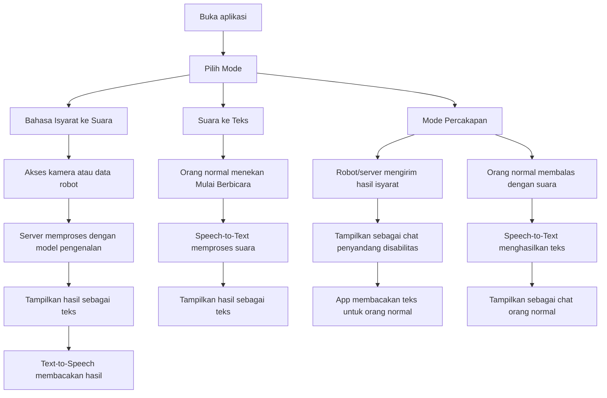

# Workflow Sign Language Assistant



## Struktur halaman

### 1. Pilih Mode

Judul: `Sign Language Assistant`

Pilihan:

- `🤟 Bahasa Isyarat → Suara`
- `🎤 Suara → Teks`
- `💬 Mode Percakapan`

### 2. Bahasa Isyarat → Suara

Digunakan saat penyandang disabilitas ingin menyampaikan pesan kepada orang normal.

Komponen:

- Status pemrosesan kamera di laptop; stream video ke HP dinonaktifkan agar ringan.
- Panel hasil pengenalan.
- Tombol `🔊 Membacakan` untuk text-to-speech.

Contoh hasil:

```text
Saya ingin minum
```

### 3. Suara → Teks

Digunakan saat orang normal ingin membalas kepada penyandang disabilitas.

Komponen:

- Tombol `Mulai Berbicara`.
- Status proses, misalnya `Tolong tunggu sebentar...`.
- Panel hasil transkripsi.

### 4. Mode Percakapan

Digunakan untuk demo komunikasi dua arah dalam satu layar.

Komponen:

- Bubble chat dari penyandang disabilitas: hasil pengenalan bahasa isyarat dari robot/server.
- Tombol `🔊 Bacakan` untuk membacakan pesan hasil isyarat.
- Bubble chat dari orang normal: hasil speech-to-text dari mikrofon HP.
- Tombol `🎤 Balas dengan Suara` untuk mulai transkripsi suara.
- Field simulasi hasil robot/model sampai integrasi server selesai.

Contoh percakapan:

```text
Penyandang Disabilitas:
Saya ingin minum

Orang Normal:
Baik, saya ambilkan minum.
```

## Integrasi lanjutan

- Hubungkan backend/model BiLSTM sebagai API prediksi.
- Kirim frame/video atau keypoint dari robot ke backend.
- Backend mengembalikan label/kalimat hasil pengenalan.
- Frontend menampilkan hasil sebagai teks, membacakan teks, dan menaruhnya di mode percakapan.
- Jika ingin realtime dari server ke mobile app, gunakan WebSocket atau Server-Sent Events.
