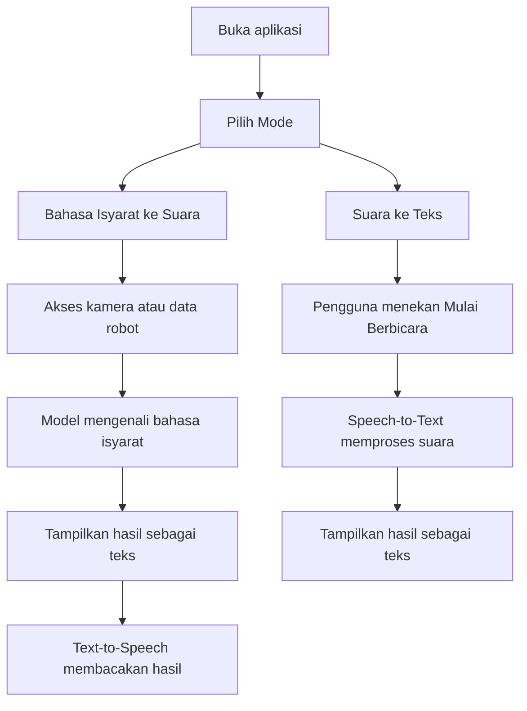

# Workflow Sign Language Assistant



## Struktur halaman

### 1. Pilih Mode

Judul: `Sign Language Assistant`

Pilihan:

- `🤟 Bahasa Isyarat → Suara`
- `🎤 Suara → Teks`

### 2. Bahasa Isyarat → Suara

Komponen:

- Area kamera/stream robot.
- Panel hasil pengenalan.
- Tombol `🔊 Membacakan` untuk text-to-speech.

Contoh hasil:

```text
Saya ingin minum
```

### 3. Suara → Teks

Komponen:

- Tombol `Mulai Berbicara`.
- Status proses, misalnya `Tolong tunggu sebentar...`.
- Panel hasil transkripsi.

## Integrasi lanjutan

- Hubungkan backend/model BiLSTM sebagai API prediksi.
- Kirim frame/video atau keypoint dari robot ke backend.
- Backend mengembalikan label/kalimat hasil pengenalan.
- Frontend menampilkan hasil dan membacakan teks.
